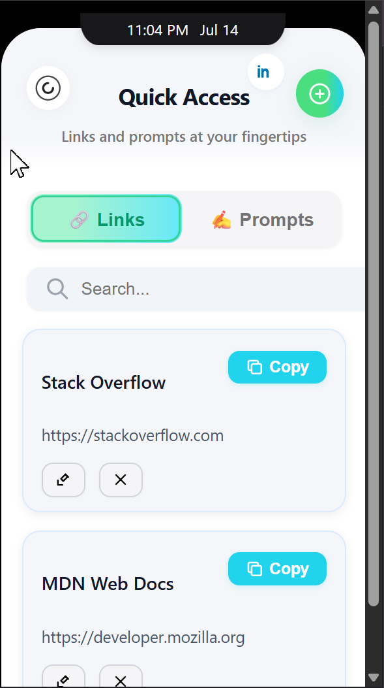
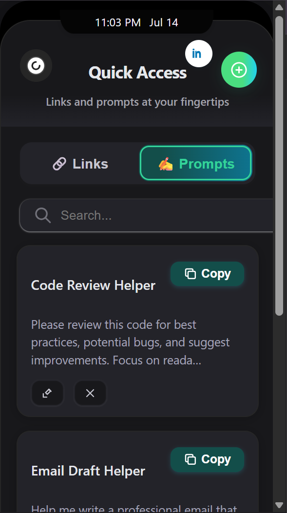
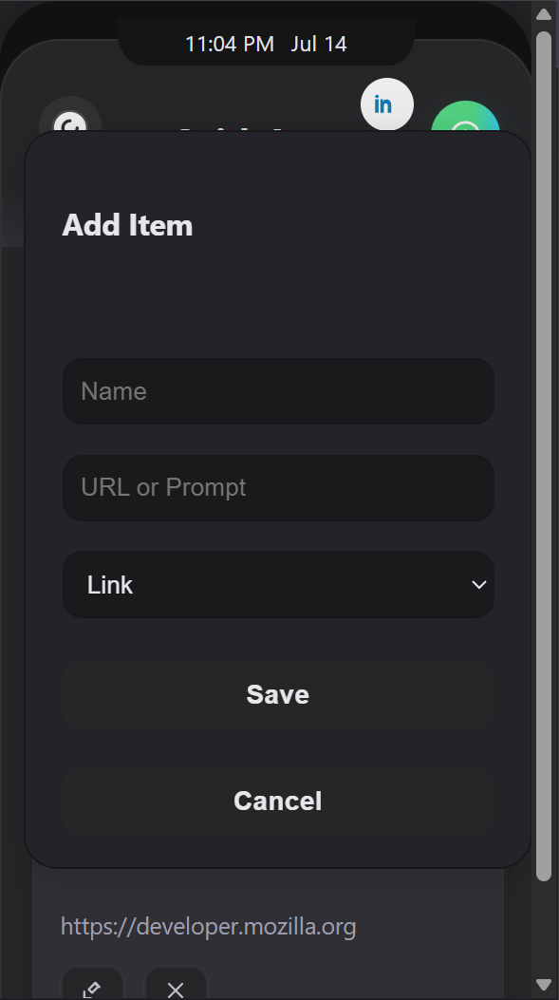
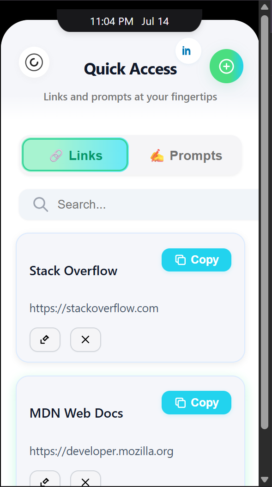
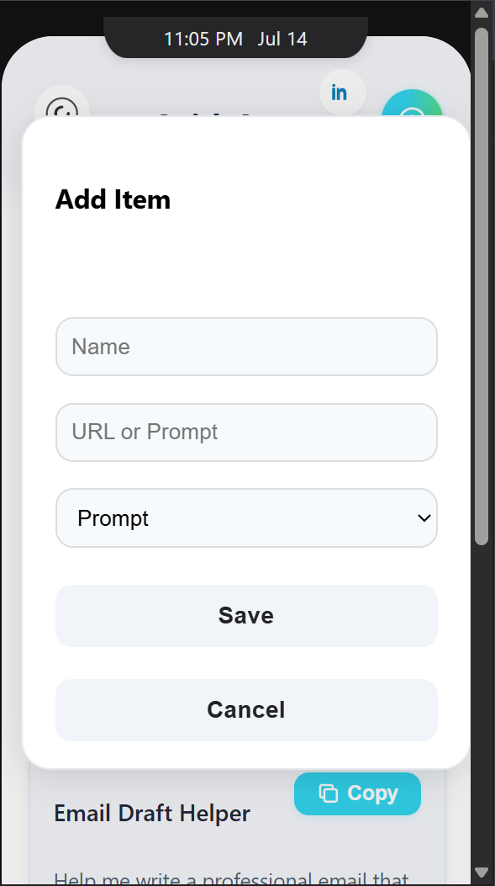

# 📌 Quick Links & Prompts — Chrome Extension

A sleek, mobile-inspired Chrome Extension that helps you save, manage, and access your most-used **links**, **AI prompts**, and (optionally) **ToDo tasks**—with full dark mode, iOS-like UI, syncing via Chrome, and smooth UX.

---

## 📲 Demo Screenshot

| iOS-inspired UI with dark mode |
|-------------------------------|
|              |

---

## 🚀 Features

- 🔗 **Store Important Links** – Add, copy, edit, or delete frequently visited websites.
- ✍️ **Manage Prompts** – Save reusable ChatGPT-style prompts to streamline your workflow.
- 📝 **ToDo List (Optional)** – Hook in your backend for task CRUD with API endpoints.
- 🔁 **Sync Across Devices** – Uses `chrome.storage.sync` for cloud backup + `chrome.storage.local` as fallback.
- 🌙 **Dark & Light Mode** – Auto-toggle and persistent dark mode setting.
- 🕓 **Live Time/Date Notch** – Real-time digital notch display like iPhone.
- 📦 **Offline Support** – Data saved locally or in Chrome Sync. No login or internet required.
- 🔒 **No Login Required** – Fully secure client-side storage.
- 🧠 **Minimal Permissions** – Only asks for what it needs (`storage`, `clipboardWrite`).

## 📸 Screenshots

| Links Tab | Prompts Tab | Add Modal | Confirmation | iOS Notch |
|-----------|-------------|-----------|--------------|-----------|
|  |  |  |  |  |


## 📂 Folder Structure

```

Quick-links/
├── dist/                       # Production-ready build
│   ├── manifest.json
│   ├── index.html
│   ├── popup.js
│   ├── styles.css
│   ├── icons/
│   └── data/
├── public/                    # Screenshots, fallback JSON
├── build.sh / build.js        # Auto script to build dist
├── README.md                  # This file

````

---

## 🧠 Technologies Used

- **JavaScript (ES6+)**
- **Chrome Extension APIs**
  - `chrome.storage.sync`
  - `chrome.storage.local`
- **HTML5 + CSS3**
- **Mobile-first Design (iOS/Apple-inspired)**

---

## 🛠️ Installation (for development)

### 1. Clone the repo
```bash
git clone https://github.com/its-kundan/quick-links.git
cd quick-links
````

### 2. Build the extension

```bash
npm run build
# OR
bash build.sh
```

### 3. Load in Chrome

* Open `chrome://extensions/`
* Enable **Developer Mode**
* Click **Load unpacked**
* Select the `dist/` folder

---

## 🧳 Publishing to Chrome Web Store

### 1. Prepare `.zip`

```bash
cd dist && rm -f ../quick-links-extension.zip && zip -r ../quick-links-extension.zip ./*

```

Or for PowerShell:

```powershell
Compress-Archive -Path .\dist\* -DestinationPath .\quick-links-extension.zip
```

```
if (Test-Path .\quick-links-extension.zip) { Remove-Item .\quick-links-extension.zip }
Compress-Archive -Path .\dist\* -DestinationPath .\quick-links-extension.zip
```

### 2. Register Developer Account

* Go to: [chromewebstore.google.com](https://chromewebstore.google.com/)
* Pay one-time **\$5 fee**
* Use a **Visa/MasterCard** (no UPI/Rupay)
* Use Zolve/Niyo/Fi card if needed

### 3. Submit Your Extension

* Upload your `.zip`
* Add screenshots (from `public/1.png` to `5.png`)
* Write store description
* Wait for review (1–5 days)

---

## 🔧 Customization

| Feature          | How to Change                                      |
| ---------------- | -------------------------------------------------- |
| 🔗 Default Data  | Edit `data/data.js`                                |
| 🎨 Styles/Colors | Modify `styles.css`                                |
| 🌐 Dark Mode     | Toggle manually in `popup.js` or use saved setting |
| 🔧 API Support   | Extend `popup.js` with fetch logic                 |
| 👤 LinkedIn      | Edit `index.html` link tag                         |

---

## 📚 Learnings from This Project

This project taught me a lot about building a real-world, deployable Chrome extension. Here’s a breakdown:

### 🔧 Technical Skills

* Learned how to build a **Manifest V3** Chrome Extension
* Mastered **Chrome APIs**: `chrome.storage.sync`, `chrome.storage.local`
* Created reusable modal components via pure JS
* Implemented **persistent dark mode**
* Understood the importance of **minimal permissions**
* Learned how to zip & deploy a clean `dist/` folder

### 🛡️ Deployment Lessons

* Discovered that **Rupay cards do not work** for Chrome Web Store payments
* Learned about **Zolve** and **Niyo Global** for issuing international cards
* Understood how to create a build process with `build.sh` / `build.js`
* Practiced preparing proper screenshots, descriptions, and metadata for publishing

### 💡 Design & UX Skills

* Designed an **iOS-like interface** from scratch
* Used **SVG icons** inline for cleaner UI
* Optimized mobile scaling inside Chrome popup
* Implemented real-time notch with time and date

### 🔥 Productivity Boost

* Built a personal tool that genuinely improves my own workflow
* Can now save prompts, links, and ToDos **with just 2 clicks**

---

## 🧱 Roadmap / Future Improvements

* [ ] Drag-and-drop sorting of links/prompts
* [ ] QR code sharing
* [ ] Keyboard shortcut activation
* [ ] Tagging / categorization
* [ ] Cloud backup integration
* [ ] VSCode extension version (inspired idea)

---

## 🙌 Credits

* Design inspired by iOS (Apple-style UI)
* Icons by [Heroicons](https://heroicons.com/)
* LinkedIn: [Kundan](https://www.linkedin.com/in/its-kundan)
* Tech stack: HTML5, CSS3, JS, Chrome APIs

---

## 📄 License

**MIT License** — Free to use, modify, and distribute for personal or commercial projects.

---

> ✉️ For feedback, issues, or collaboration ideas — feel free to connect on LinkedIn!


